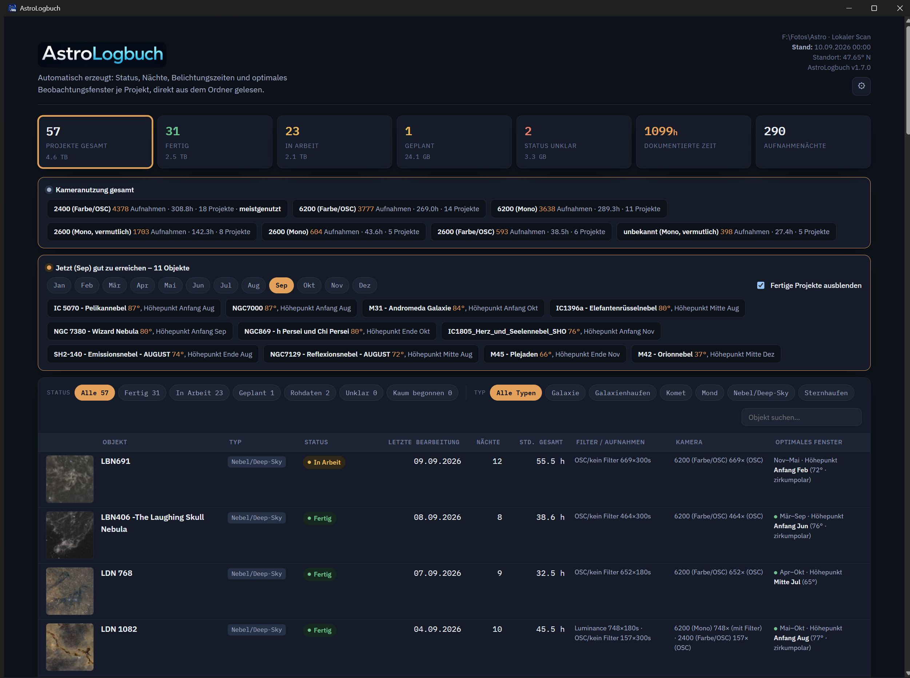
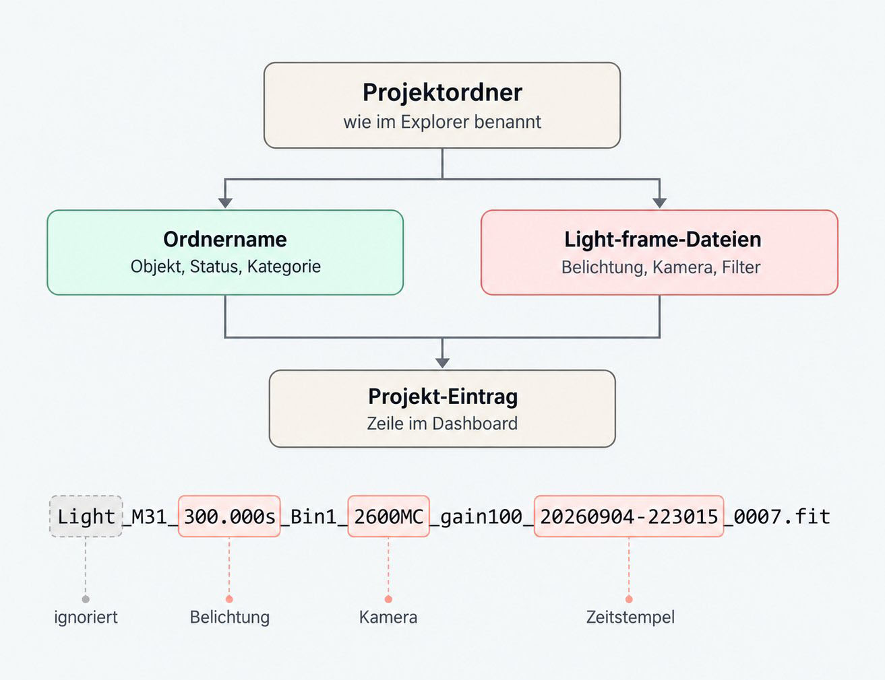
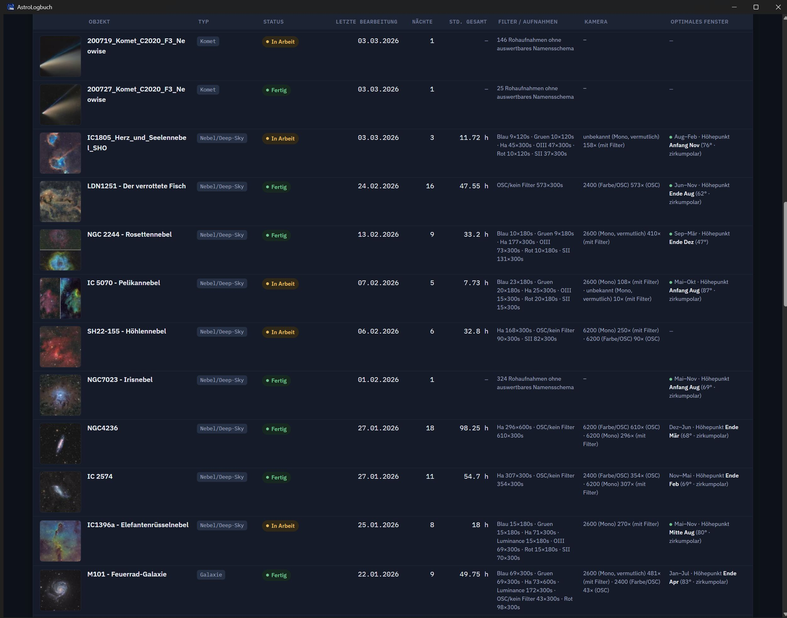

# AstroLogbuch

Liest einen Astrofoto-Ordner automatisch aus und zeigt Status, Belichtungszeit,
Kamera/Filter und das optimale Beobachtungsfenster für jedes Projekt in einem
lokalen Dashboard – ohne Installation, ohne Internetzwang, ohne Cloud.



## Was macht das Programm?

AstroLogbuch durchsucht einen gewählten Ordner nach Projektunterordnern und
liest daraus zwei unabhängige Quellen aus:

- aus dem **Ordnernamen** werden Objekt, Status und Kategorie abgeleitet
- aus den enthaltenen **Light-Frame-Dateien** (ASIAIR-/N.I.N.A.-Namensschema)
  werden Belichtungszeit, Kamera und Filter ausgelesen



Daraus entsteht pro Projekt eine Tabellenzeile mit unter anderem Status,
Nächten, Gesamt-Belichtungszeit, Kamera(s)/Filter, Datenmenge, letztem
Änderungsdatum und einem Vorschaubild, sofern bereits ein fertiges Bild
vorliegt.



Für jedes erkannte Objekt wird zusätzlich berechnet, in welchen Monaten es gut
zu beobachten ist (Panel „Jetzt gut zu erreichen", mit Monatsleiste zum
Durchblättern). Die Koordinaten dafür stammen aus einem eingebauten Katalog
mit rund 14.000 Objekten (abgeleitet aus [OpenNGC](https://github.com/mattiaverga/OpenNGC)),
ergänzt um eine optionale Online-Namensauflösung.

## Eigenschaften

- läuft vollständig lokal, liest den Astro-Ordner nur (keine Schreib-/
  Löschfunktion), kein Internetzwang
- eigenes Programmfenster (kein Browser-Tab nötig), plattformübergreifend
  (Windows als fertige EXE, macOS/Linux über den Python-Quellcode)
- Status (Fertig/In Arbeit/Geplant/Nur Rohdaten/Unklar) wird automatisch aus
  dem Ordnernamen erkannt, u. a. über ein „Done"-/"Fertig"-Tag
- Kamera-Rohcodes werden über alle Projekte hinweg nach Modellnummer
  zusammengeführt, inklusive Mono-/Farb-Erkennung
- eigene Kamera-/Filterbezeichnungen, ausgeschlossene Ordner und
  Kalibrier-Schlüsselwörter über die Einstellungen anpassbar
- Ortsnamen-Suche für den Breitengrad (Nominatim/OpenStreetMap)

## Download

**Windows:** [Releases](../../releases) → aktuelle `AstroLogbuch.exe`
herunterladen und starten. Keine Installation nötig, keine weitere Software.

Da die EXE nicht mit einem kostenpflichtigen Software-Zertifikat signiert ist,
kann Windows SmartScreen beim ersten Start warnen. In diesem Fall auf
„Weitere Informationen" → „Trotzdem ausführen" klicken.

**macOS/Linux:** `astro_dashboard.py` aus diesem Repository herunterladen und
direkt mit Python starten:

```bash
pip3 install pywebview pillow
python3 astro_dashboard.py
```

Details und Systemvoraussetzungen siehe [LIESMICH_MAC_LINUX.txt](LIESMICH_MAC_LINUX.txt).

## Grenzen

Am zuverlässigsten funktioniert AstroLogbuch mit Aufnahmen von ASIAIR oder
N.I.N.A., da erst deren festes Dateinamensschema die Auswertung von
Belichtungszeit, Kamera und Filter ermöglicht. Andere Aufnahmesoftware wird
gezählt, aber nicht im Detail ausgewertet. Status und Objekterkennung hängen
vollständig vom Ordnernamen ab. Kometen bekommen bewusst nie ein
Beobachtungsfenster, da sich ihre Position laufend ändert.

Ausführliche Dokumentation: [ANLEITUNG.txt](ANLEITUNG.txt)
Änderungshistorie: [CHANGELOG.txt](CHANGELOG.txt)

## Lizenz

[MIT](LICENSE)
